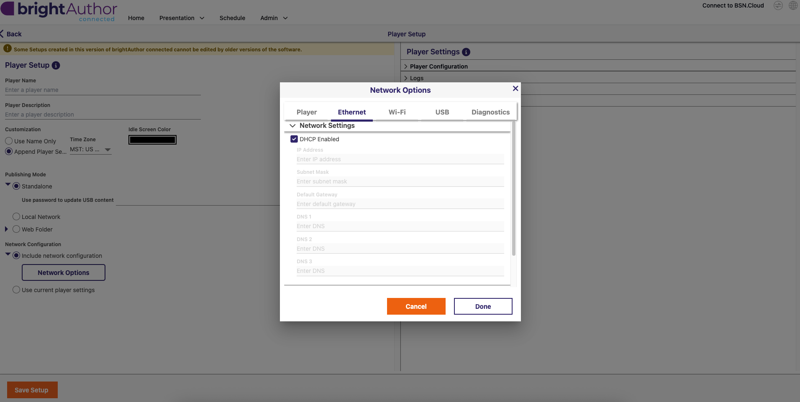
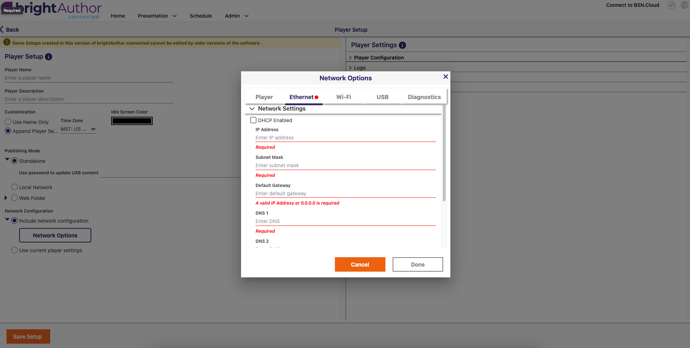

# Communicating between ESP32s3 + BrightSign w/ UDP Commands

# Overview

This sketch mainly serves as a proof of concept to showcase how an ESP32s3 could send UDP commands to a BrightSign media player via a direct Ethernet connection. In this case, 3 buttons trigger different UDP commands, which show up as raw string texts on the monitor the BrightSign is connected to (see video above). This is the first stepping stone that'll ideally open the door for more interactivity between user inputs and video outputs!

# Hardware

- Microcontroller: Waveshare's [ESP32S3-ETH module](https://www.waveshare.com/esp32-s3-eth.htm?sku=28972)
- Media Player: BrightSign HD6
- Monitor: Acer 15.6" monitor

# Steps for BrightSign Player Setup in brightAuthor:connected

1. With microSD card inserted into computer, open brightAuthor:connected and navigate to Player Setup menu
2. Input basic settings like Player Name, Player Description, and ensure the correct player is selected in BrightSignOS Update dropdown (with latest released version selected)
3. Click the "Include network configuration" checkbox AND dropdown under the **Network Configuration** section
   
4. Open **Network Options**
5. Navigate to the **Ethernet** tab and select the "Network Settings" dropdown.
   
6. Uncheck the "DHCP Enabled" checkbox, address fields will be red/empty but configurable now
   
7. Enter the following addresses:
   - **IP Address**: 192.168.50.10
   - **Subnet Mask**: 255.255.255.0
   - **Default Gateway**: 0.0.0.0 (not needed)
   - **DNS**: 0.0.0.0 (not needed)
8. Click done and save the setup to the mounted microSD card.
9. Follow along with this [video](https://docs.brightsign.biz/how-tos/use-serial-udp-commands) for more info on UDP and Variables in brightAuthor:connected Presentations
